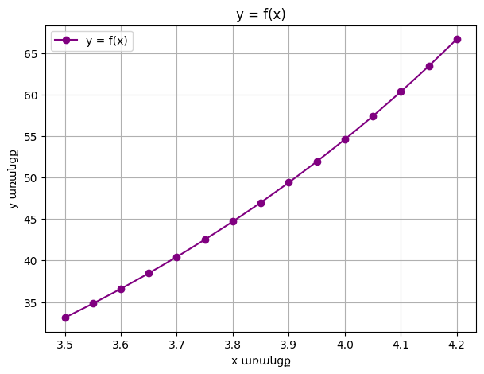

# Curve Fitting & Function Approximation (Least Squares Method)

This folder contains a computational systems modeling project focused on mathematical curve fitting and empirical data approximation using the Method of Least Squares.

##  Implemented Methodology
* **Data Approximation:** Mapping experimental data points ($X_i, f_i$) into continuous mathematical formulations to extract system behavior patterns.
* **Multi-Model Evaluation:** Fitting and testing different mathematical functions, including linear models, power functions, and exponential regression types ($y = a \cdot e^{bx}$).
* **Deviation Minimization:** Calculating the sum of squared residuals to evaluate approximation errors and algorithmically select the mathematically optimal curve with the highest goodness-of-fit.

##  Model Visualization
Below is the graphical representation of the empirical data points plotted against the fitted mathematical approximation curves to visualize the accuracy of the Least Squares Method:

  

*The chart highlights the distribution of experimental data nodes ($X_i, f_i$) and tracks how closely the evaluated regression functions minimize the residual errors across the coordinate field.*

##  Technologies Used
* **Python 3**
* **NumPy:** For vector calculations and matrix structures.
* **Pandas:** For structural logging of coordinates and model outputs.
* **SymPy:** For symbolic mathematics, algebraic expressions, and functional evaluations.
